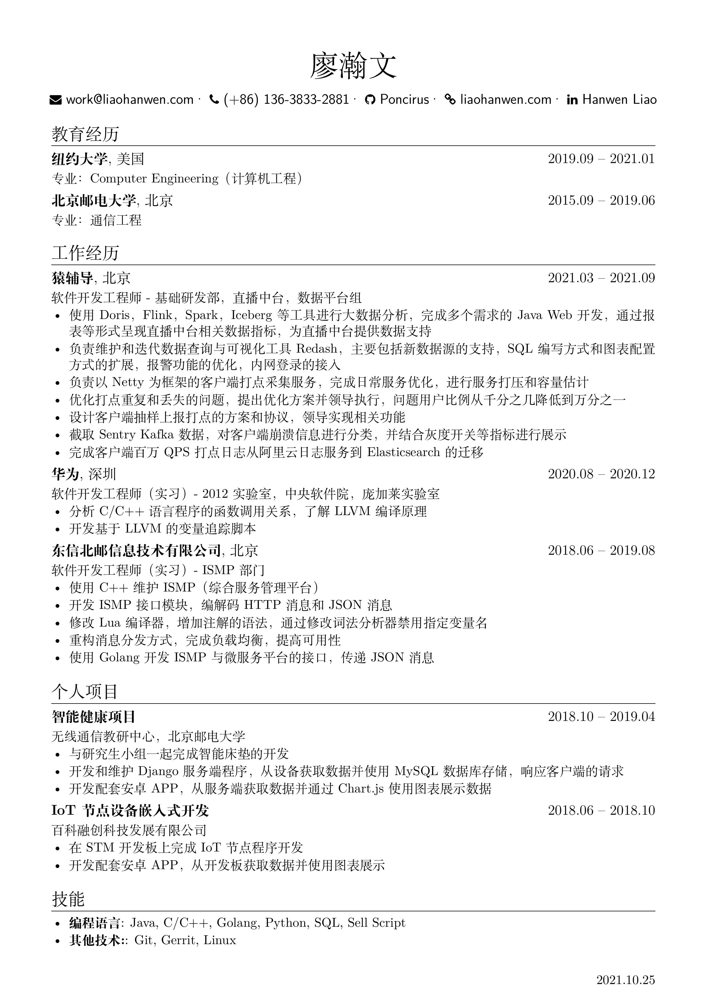
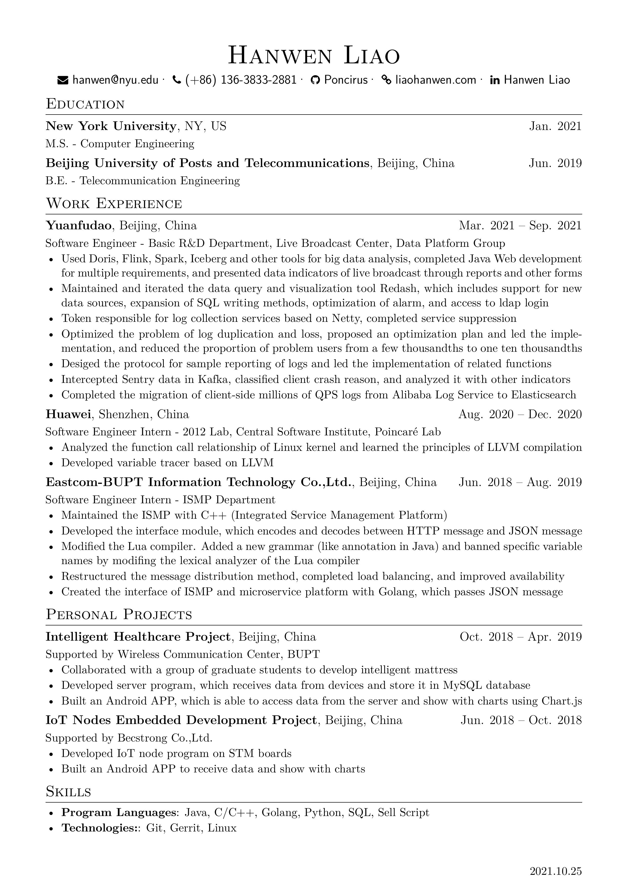

# Resume

Resume / 我的简历

Based on [this project](https://github.com/ice1000/resume)

## Build

Use XeLaTeX to compile.

Can use [Overleaf](https://www.overleaf.com/) for online compliation (Remember to switch compiler to XeLaTeX) 

## Download

### English Version
[PDF](./resume.pdf) &emsp; [JPG](./resume.jpg)

### 中文版
[PDF](./resume-cn.pdf) &emsp; [JPG](./resume-cn.jpg)

## Preview

 
